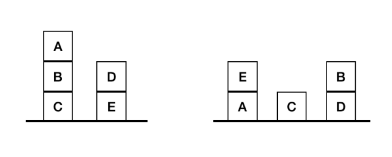

# Blocks World Problem
This program solves the Blocks World problem using the A* algorithm. Specifically, the goal of the game is to rearrange blocks from an initial arrangement to a goal state, following specific rules:

- Only one block can be moved at a time.  
- A block can be placed either on top of another block or on the table.

## How to Run

To run the program, simply use the command:  
```sh
./run.sh
```

If compilation or execution is not possible, first run:
```sh
chmod +x run.sh
```
I have created an `input.txt` file where you can input any values you want, and the program runs using the above command.

In the input.txt file, provide the values in the following order:

- Which heuristic you want to use (1 or 2)

- The number of blocks

- The initial state, consisting of uppercase Latin letters (each space denotes a different stack of blocks)

- The goal state, consisting of uppercase Latin letters (each space denotes a different stack of blocks)

For example, for the following state:


 
The input.txt file should contain:

 ```sh
1
5
CBA ED
AE C DB
 ```
## Files and Folders

1) `main.c` : The main function of the program.
2) `pqueue.c` : Priority queue implementation.
3) `pqueue.h` : Header file for pqueue.c.
4) `state.c` : Functions for states.
5) `state.h` : Header file for state.c.
6) `vector.c` : Implementation of vector struct.
7) `vector.h` : Header file for vector.c.
8) `makefile` : Makefile for the program.
9) tests/ : Folder with tests to check execution time.
10) `time.pdf` : Table with execution times based on tests.
11) `run.sh` : Runs the program redirecting input from input.txt.
12) `testing.sh` : Quickly run any test.

## Functionality

1) ### Functions state.c

- structs:

    `State`: Stores the current state of the blocks.

    `CState`: A representation of the state for efficient storage and comparison.

- heuristics:

    `state_cmp1`:  Calculates the heuristic based on the number of blocks not in the correct position.

    `state_cmp2`: Calculates a penalty by counting how many blocks need to be moved to reach the final arrangement.

    If a block is in the wrong position or has wrong blocks beneath it, a penalty for one move is added.
    
    If a block is correctly placed but supports others that must move, a penalty for a second move is added.

- expand:

    `state_expand1` and `state_expand2`: Generate new states by moving blocks and add them to the priority queue.

- print:

    `state_print_moves`: Displays the sequence of moves leading to the solution.
2) ### Functions in  pqueue.c

- structs:

    `PQNodeTag`: Stores the data and priority of an element, as well as a pointer to the next element in the list.

    `pqueue`: Stores the number of elements and a pointer to the start of the list.

- Functions:

    `pq_create`: Creates a priority queue.

    `pq_empty`: Checks if the priority queue is empty.

    `pq_insert`: Inserts a new element into the priority queue in the correct order.

    `pq_remove`: Removes and returns the element with the highest priority.

    `pq_top`: Returns the element with the highest priority without removing it.

    `pq_destroy`: Frees all memory used by the priority queue.
3) ### Functions in vector.c

#### Role of Vector in the Blocks World Problem

In the Blocks World Problem, each State is represented as a collection of stacks of blocks. Each stack is a dynamic array containing blocks from the table upward. For example, a stack A B C means block A is on the table, B is on A, and C is on B.

A `Vector` is used to represent each block stack. Each Vector corresponds to a stack and contains its blocks.


- Representation of Block Stacks:

    Each State contains an array of `Vector`s.

    The blocks in each stack are stored in a `Vector`, with the first block representing the one on the table and the rest above it.

```c
    struct state {
        Vector blocks[26];  //array of vectors
        int moves;          
        int penalty;        
        CState parent;      
    };
```
- Adding Blocks:

    When a block is moved from one stack to another, the function `vector_push_back` is used to add the block to the new stack.

```c
    vector_push_back(tower, to_put); 
```
- Removing Blocks:

    When a block is removed from a stack, the function `vector_pop` removes the last block (the one on top).

```c
    char to_put = vector_pop(curr->blocks[i]); 
```
- Accessing Blocks:

    The function `vector_at` accesses a specific block in a stack.

```c
    char block = vector_at(tower, index); 
```
- Changing Stack Size:

    `vector_set_size` simply sets how many elements are valid in the Vector's internal array.

```c
    void vector_set_size(Vector vector, int size); 
```

## Memory

The program is tested with Valgrind to ensure it is fully memory-safe and has no leaks.
## Example Runs

Below are two example runs of the program:

### Example 1
```sh
$ cat input.txt
1
5
CBA ED
AE C DB
$ ./run.sh
gcc -g3 -Wall -Wextra -Werror -pedantic   -c -o main.o main.c
gcc -g3 -Wall -Wextra -Werror -pedantic   -c -o pqueue.o pqueue.c
gcc -g3 -Wall -Wextra -Werror -pedantic   -c -o state.o state.c
gcc -g3 -Wall -Wextra -Werror -pedantic   -c -o vector.o vector.c
gcc -g3 -Wall -Wextra -Werror -pedantic main.o pqueue.o state.o vector.o -o test
==4036== Memcheck, a memory error detector
==4036== Copyright (C) 2002-2017, and GNU GPL d, by Julian Seward et al.
==4036== Using Valgrind-3.15.0 and LibVEX; rerun with -h for copyright info
==4036== Command: ./test
==4036== 
Which heuristic algorithm you want(1-2): 
Give the number of cubes: 
Type the initial state: 
Type the goal state: 
Initial state:
CBA ED 
Goal state:
AE C DB 

Required Moves: 4

CBA ED ->
CBA E D ->
CB E D A ->
CB D AE ->
C DB AE 

==4036== 
==4036== HEAP SUMMARY:
==4036==     in use at exit: 0 bytes in 0 blocks
==4036==   total heap usage: 108 allocs, 108 frees, 13,586 bytes allocated
==4036== 
==4036== All heap blocks were freed -- no leaks are possible
==4036== 
==4036== For lists of detected and suppressed errors, rerun with: -s
==4036== ERROR SUMMARY: 0 errors from 0 contexts (suppressed: 0 from 0)
rm -f test main.o pqueue.o state.o vector.o
```
### Example 2
```sh
$ cat input.txt
1
6
AB CDEF
BCEAD F
$ ./run.sh
./run.sh
gcc -g3 -Wall -Wextra -Werror -pedantic   -c -o main.o main.c
gcc -g3 -Wall -Wextra -Werror -pedantic   -c -o pqueue.o pqueue.c
gcc -g3 -Wall -Wextra -Werror -pedantic   -c -o state.o state.c
gcc -g3 -Wall -Wextra -Werror -pedantic   -c -o vector.o vector.c
gcc -g3 -Wall -Wextra -Werror -pedantic main.o pqueue.o state.o vector.o -o test
==291683== Memcheck, a memory error detector
==291683== Copyright (C) 2002-2017, and GNU GPL d, by Julian Seward et al.
==291683== Using Valgrind-3.15.0 and LibVEX; rerun with -h for copyright info
==291683== Command: ./test
==291683== 
Which heuristic algorithm you want(1-2): 
Give the number of cubes: 
Type the initial state: 
Type the goal state: 
Initial state:
AB CDEF 
Goal state:
BCEAD F 

Required Moves: 8

AB CDEF ->
AB CDE F ->
AB CD FE ->
A CD FE B ->
A C FE B D ->
A FE BC D ->
A F BCE D ->
F BCEA D ->
F BCEAD 

==291683== 
==291683== HEAP SUMMARY:
==291683==     in use at exit: 0 bytes in 0 blocks
==291683==   total heap usage: 4,323 allocs, 4,323 frees, 211,070 bytes allocated
==291683== 
==291683== All heap blocks were freed -- no leaks are possible
==291683== 
==291683== For lists of detected and suppressed errors, rerun with: -s
==291683== ERROR SUMMARY: 0 errors from 0 contexts (suppressed: 0 from 0)
rm -f test main.o pqueue.o state.o vector.o
```
## Tests
Additionally, I have created several tests with a varying number of cubes in order to measure the execution time of the program as the number of cubes increases.
In the file `time.pdf`, I have compiled a table showing the execution times of both heuristic 1 and heuristic 2 for up to 10 cubes, since for more than 10 cubes I waited 45 minutes without getting a result.
All the tests I created to observe the program’s execution time are included in the tests folder.

### Test Execution
If you want to run each test yourself, you can do so by executing the following commands in sequence:
```sh
$ make
$ chmod +x ./testing.sh
$ ./testing.sh
```
You will then be prompted to enter the number of the test you want to run (from 1 to 21 — I created a total of 21 test cases), and the corresponding test case will be executed. Here's an example:
### Example Test Case Execution
```sh
$ cat tests/test5.txt
2
5
ABCD
$  make
gcc -g3 -Wall -Wextra -Werror -pedantic   -c -o main.o main.c
gcc -g3 -Wall -Wextra -Werror -pedantic   -c -o pqueue.o pqueue.c
gcc -g3 -Wall -Wextra -Werror -pedantic   -c -o state.o state.c
gcc -g3 -Wall -Wextra -Werror -pedantic   -c -o vector.o vector.c
gcc -g3 -Wall -Wextra -Werror -pedantic main.o pqueue.o state.o vector.o -o test
$ chmod +x ./testing.sh
$ ./testing.sh
Enter a number between 1 and 21:
5
Which heuristic algorithm you want(1-2): 
Give the number of cubes: 
Type the initial state: 
Type the goal state: 
Initial state:
ABCD E 
Goal state:
DBCA E 

Required Moves: 5

ABCD E ->
ABC E D ->
AB E D C ->
A E DB C ->
A E DBC ->
E DBCA 


real    0m0,002s
user    0m0,001s
sys     0m0,000s
```

## Sources
Below are the sources I used to explore additional heuristics and to better understand how the A* algorithm works, as well as the general concept of the Blocks World problem.

- [Heuristic Search](https://techworldthink.github.io/MCA/Download/S2/El%20-%20AI/1/AI_HeuristicSearch_2.2.pdf)
- [Stack Overflow](https://stackoverflow.com/questions/46394557/artificial-intelligence-blocksworld-heuristic-a-solution-approach)
- [Explanation Video](https://www.youtube.com/watch?v=iHFzUds7zYk)
- [A* Video](https://www.youtube.com/watch?v=ySN5Wnu88nE)
- [A* Video2](https://www.youtube.com/watch?v=GazC3A4OQTE&feature=youtu.be)
- [Blocks World Problem](https://assets.ctfassets.net/kdr3qnns3kvk/1y7d9UxoFuF7aN6afDftzs/ddb79e8893b8393fc36f6b0feb357b69/BlocksWorld.pdf)